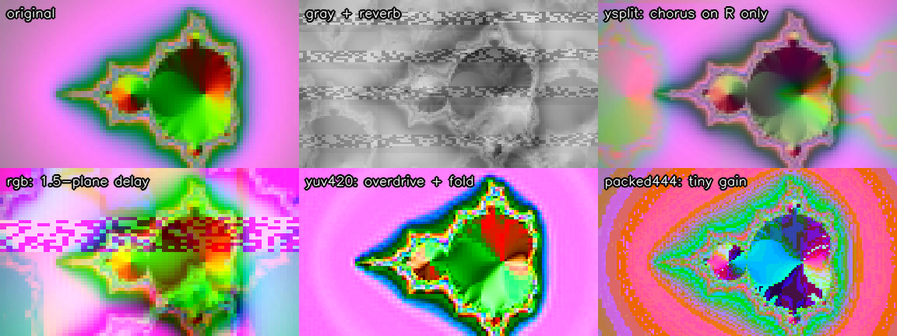

# vbend

**Circuit-bend video with audio plugins.** vbend turns a video into a 192 kHz WAV, you mangle it
in any DAW with reverbs, delays, distortion and automation, and vbend turns the result back
into video. A live preview shows the picture while the DAW plays, so audio plugins behave like a
video effects rack.



- **Bit-exact round trip**: no effects in, identical pixels out.
- **Sync that survives effects**: every frame starts with a noise burst that the decoder finds
  again after latency, gain, EQ, echo or phase flips, and it also identifies the mode.
- **Live preview** from your DAW's output, re-locking in ~0.3 s when you seek, with an optional
  limited speaker monitor.
- **Fast decoding**: rendered WAVs turn back into MP4 at 10 to 60× real time, optionally with the
  clip's original sound.

## Install

Python 3.9+ and ffmpeg. Live preview needs Linux with PipeWire or PulseAudio; encoding and
decoding work anywhere.

```bash
git clone https://github.com/<you>/vbend.git && cd vbend
python3 -m venv .venv && . .venv/bin/activate
pip install -r requirements.txt
python3 vbend.py
```

Fedora: `sudo dnf install python3-tkinter pulseaudio-utils ffmpeg`, where `ffmpeg` is the full
build from [RPM Fusion](https://rpmfusion.org) (`sudo dnf swap ffmpeg-free ffmpeg --allowerasing`);
the default `ffmpeg-free` can't read HEVC phone video.
Debian/Ubuntu: `sudo apt install python3-tk pulseaudio-utils ffmpeg`.
Run vbend as your normal user, not with sudo, so it can reach PipeWire.

## Workflow

1. **Encode tab**: pick a mode and drop videos in. Each one becomes `<name>.<mode>.wav`
   (and, if ticked, `<name>.audio.wav` with the clip's own sound).
2. **Live preview tab**: *Create 192k output* makes a silent 192 kHz output called
   `vbend-192k`. Point your DAW at it (for Wine: `PULSE_SINK=vbend wine ...`, or move the stream
   in pavucontrol), set the project to 192 kHz, and click *Start preview*.
3. Put the video WAV on a track, add effects, and watch. Tick **Listen** to hear it at a safe
   level; drop the `.audio.wav` on another track and solo it when you need the original sound.
   Anything else playing into vbend-192k is drawn into the picture too.
4. Render the mix: 192 kHz, 32-bit float, stereo, no normalize, no dither.
5. **Decode tab**: drop the render in to get `<name>.mp4`. Add the original clip as *Soundtrack*
   to put its audio back.

Batch-convert a folder: `python3 tools/batch_encode.py ~/clips -m rgb --audio`.

## Modes

| mode | size | layout | bends like |
|---|---|---|---|
| `gray` | 160×90 | brightness, spread over L/R | the cleanest, most readable bends |
| `ysplit` | 112×64 | **L = brightness, R = color** | FX on L bend light, FX on R bend color, stereo FX fringe |
| `yuv420` | 128×72 | Y, U, V planes in sequence | time-based FX bleed brightness into color |
| `rgb` | 96×52 | R, G, B planes in sequence | delays pull the colors out of register |
| `packed444` | 160×90 | R, G, B stacked in one number | anything at all → confetti |

### Effect cheat sheet

- One frame = **8000 samples** per channel. Delays of whole frames give trails and feedback.
- One image row, per channel: gray 80, ysplit 112 (L) / 56 (R), yuv420 64, rgb 48 samples.
  A delay of N rows ghosts the picture N rows down.
- Lowpass → horizontal smear · bitcrusher → posterize · distortion + `fold` → solarize.
- An effect on one channel only: vertical stripes in gray/yuv420/rgb, color-only in ysplit.
- Highpass / DC blockers pull flat areas toward gray (the embossed look).

### Out-of-range samples
`clip` (default), `white`, `wrap` (overflow snaps back to black) or `fold` (solarize).

## Command line

```bash
python3 vbend.py encode clip.mp4 -m ysplit --audio
python3 vbend.py decode render.wav --oob fold --soundtrack clip.mp4
python3 vbend.py decode render.wav -m rgb --nudge 12     # force a mode, shift alignment
python3 vbend.py live                                   # preview window only
python3 vbend.py sink up | down | status
```

## Troubleshooting

| symptom | cause / fix |
|---|---|
| Live says *searching*, picture scrambled | Something resampled or changed gain. `pw-top` should show 192000 for vbend and the DAW; keep every volume at 100 % / 0 dB. |
| "Host is down" / can't reach PipeWire | Running under sudo, SSH or a container. Use a normal desktop terminal. |
| PipeWire won't run at 192 kHz | Add `context.properties = { default.clock.allowed-rates = [ 44100 48000 96000 192000 ] }` to `~/.config/pipewire/pipewire.conf.d/10-vbend.conf`, then `systemctl --user restart pipewire pipewire-pulse`. |
| Decode warns *weak sync* | Heavy effects on the bursts. Force the Mode and use Nudge. |
| *polarity inverted* | A plugin flipped phase. Tick *invert* (or keep the negative). |
| Picture rolls slowly | Pitch/time-stretch changed the length; alignment is taken from the first 2 s. |
| "no decoder found for: hevc" | Your ffmpeg lacks HEVC (Fedora `ffmpeg-free`); install the full build. |

## How it works

See [docs/format.md](docs/format.md) for the exact sample layout, sync bursts and detection.
Run the tests with `pytest` (or `python3 tests/test_vbend.py`).

## License

MIT, see [LICENSE](LICENSE).
